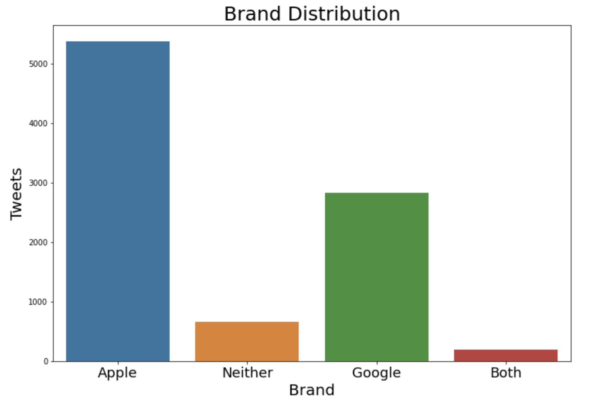
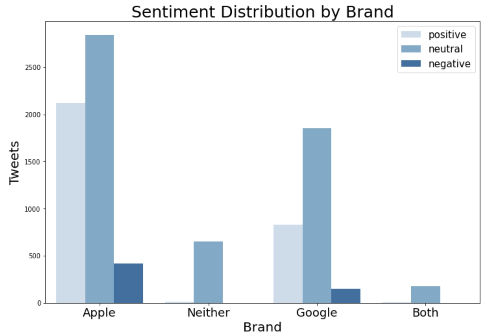

# Aaron Galbraith Flatiron Data Science Phase 4 Project

## Overview

Apple promoted a new iPad version at a widely-attended culture and arts festival in 2011. Over 9,000 tweets that all had hashtags associated with the festival and also (mostly) mentioned either Apple or Google were collected in a data set. We analyzed these tweets and made recommendations for Apple based on our findings.

## Business and Data Understanding

### Business Understanding

Apple launched the iPad 2 on March 11, 2011, the same day that the 2011 SXSW Festival began in Austin, Texas. Apple also launched a pop-up store in Austin specifically to sell these and other products to the swell of crowds who attended the festival that year.

Following the festival, Apple wished to gain insight into how its presence at the festival had been received. Tweets with the hashtag #sxsw were collected and labeled according to 1) what sentiment if any they expressed and 2) which if any tech brands or products (limited to Apple and Google) were mentioned. Apple wanted to know what it could learn not only from its own festival presence but also from Google's presence at the same festival.

This kind of information can help Apple understand both how to improve on the success of this launch in the future and how to avoid mistakes they or Google may have committed at the festival. Apple can also benefit from a machine learning model that helps them distinguish positive tweets from non-positive tweets on a massive scale so that this analysis can continue.

### Data Understanding
The data set included 9,092 tweets, all with the #sxsw hashtag. Each record had three features:
#### Text
This feature was the text of the tweet.
#### Brand
The original data had labels indicating which product (iPhone, iPad, Android, etc.) the tweet referred to or in many cases just the brand (Apple or Google). Many of the tweets did not have any product or brand label. We were able to fill the vast majority of these missing brand labels by searching through the text feature of each record for key words relating to Apple or Google.

Many records were ultimately labeled "both" or "neither".

#### Sentiment
All tweets were labeled (by humans) as having a sentiment that was positive, negative, neutral, or "I can't tell". We merged the (very few) "I can't tell" labels with neutral labels so that there were effectively only three sentiments.

Practically all tweets that mentioned *both* Apple and Google or *neither* of them were labeled neutral.

There were roughly twice as many tweets about Apple as there were about Google.

Apple's positive-negative count was 39.4%-7.7%.

Google's positive-negative count was 29.2%-5.3%.

## Modeling

There were so few tweets with negative sentiments that it caused a class imbalance issue. We decided to make a binary classifier between positive and non-positive tweets (by grouping negative and neutral tweets together as "non-positive"). Consolidating sentiments into a binary classification reduced the class imbalance problem. 67.4% of the records were labeled non-positive and 32.6% positive.

The goal in this case was simply to predict these labels as accurately as possible overall. If we had chosen to classify all three sentiments, then it might have made more sense to choose precision or recall of positive or negative tweets, but the only metric we used was accuracy.

The only other consideration was overfitting; we discounted models whose training accuracy was significantly higher than their test accuracy, even if the test accuracy was better than that of other models.

### Naive Bayes (BASELINE)
The basic Naive Bayes model gave training/test accuracies of 79.4%/71.5%. This and all other models involved removing a common list of stop words (as well as a list of stop words that we supplemented) and tokenizing, lemmatizing, and vectorizing the tweet text feature.

When we tuned the Naive Bayes model, we improved both scores (89.0%/72.2%). However, since it also widened the gap between training and test accuracy, we recognize this as an instance of overfitting the training data.

When we experimented with oversampling, it improved the training accuracy but worsened the test accuracy (86.7%/68.0%). Following this result, we abandoned all attempts at oversampling.

### Random Forest
The Random Forest models gave more examples of overfitting. The first result was 96.5%/73.2%, and the tuned model was 86.4%/72.5%.

### Gradient Boost (FINAL)
The Gradient Boost model, in our view, gave the strongest result without obviously overfitting the training data (74.9%/72.3%).

### Summary of Model Performance

We experimented with some other models as well, but none of the results were as relevant as the main three mentioned above.

| Model | Training Accuracy | Test Accuracy |
| -------- | ------- | ------- |
| Logistic Regression (rough) | 95.9% | 62.6% |
| Logistic Regression (oversampled) | 95.8% | 61.7% |
| Naive Bayes (rough) | 79.4% | 71.5% |
| Naive Bayes (tuned) | 89.0% | 72.2% |
| Naive Bayes (oversampled) | 86.7% | 68.0% |
| Decision Trees (rough) | 96.5% | 70.5% |
| Decision Trees (tuned) | 79.3% | 71.6% |
| Bagged Trees | 74.7% | 71.7% |
| Random Forest (rough) | 96.5% | 73.2% |
| Random Forest (tuned) | 86.4% | 72.5% |
| Support Vector Machine | 92.6% | 74.3% |
| Adaboost | 74.1% | 70.6% |
| Gradient Boost | 74.9% | 72.3% |
| XG Boost | 84.1% | 73.3% |

## Evaluation

Most of the models betray evidence of overfitting the training data. The Bagged Trees, Adaboost, and Gradient Boost models were the only ones we considered likely not to be overfit. Of these three, Gradient Boost had the best test accuracy.

## Recommendations

## Further Inquiry

More sophisticated modeling techniques might be able to better analyze either a direct positive v. negative comparison or even a multi-class analysis (positive, negative, and neutral). The class imbalances make this difficult.

More direct analysis could be done with the tweets that mentioned *both* Apple and Google brands. Perhaps these tweets feature direct comparisons that could be very illuminating.

With more time we would have liked to explore feature importances of the various models.

We would also like to have explored *why* the models were overfitting the training data so consistently and what aspects could have been changed to prevent this.

We would have liked to investigate other features, such as tweet length (counting both characters and words), to see if that added anything to the models.

## Links to PDFs

Find the notebook [here](https://github.com/aarongalbraith/flatiron-phase4-project/tree/main/deliverables/notebook.pdf)

Find the presentation [here](https://github.com/aarongalbraith/flatiron-phase4-project/tree/main/deliverables/presentation.pdf)

Find the github repository [here](https://github.com/aarongalbraith/flatiron-phase4-project/tree/main/deliverables/github.pdf)