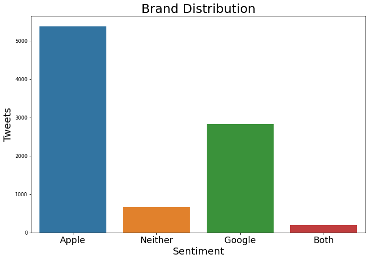
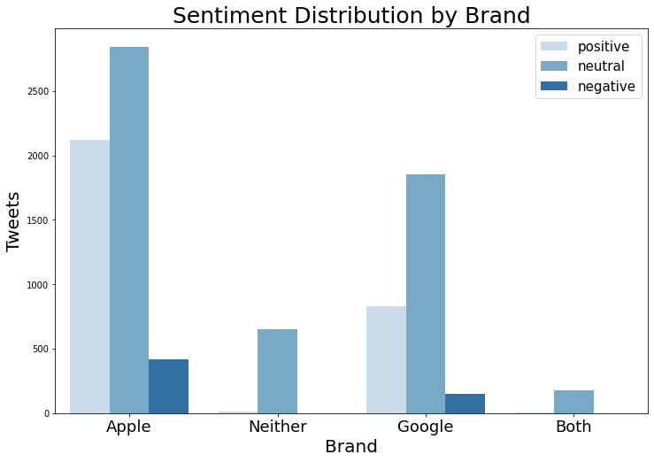

# Aaron Galbraith Flatiron Data Science Phase 4 Project

## Overview

Apple promoted a new iPad version at a widely-attended culture and arts festival in 2011. Over 9,000 tweets — with hashtags indicating they referred to the festival — were collected that mentioned either Apple or Google. We analyzed these tweets and make recommendations for Apple based on the findings.

## Business and Data Understanding

### Business Understanding

Apple launched the iPad 2 on March 11, 2011, the same day that the 2011 SXSW Festival began in Austin, TX. Apple also launched a pop-up store in Austin specifically to sell these and other products to the swell of crowds who attended the festival that year.

Following the festival, Apple wished to gain insight into how its presence at the festival had been received. Tweets with the hashtag #sxsw were collected and labeled according to 1) what sentiment if any they expressed and 2) which if any tech brands or products (limited to Apple and Google) were mentioned. Apple wanted to know what it could learn not only from its own festival presence but also from Google's presence at the same festival.

### Data Understanding
The data included 9,092 tweets, all with the #sxsw hashtag. Each record had three features:
#### Text
This was the text of the tweet.
#### Brand
The original data had labels indicating which product (iPhone, iPad, Android) the tweet referred to or just the brand (Apple or Google) instead. Many of the tweets did not have any product or brand label. A key word search was helpful in filling the vast majority of these labels.

Many records were ultimately labeled "both" or "neither".

#### Sentiment
All tweets were labeled (by humans) as having a sentiment that was positive, negative, neutral, or "I can't tell". We merged the very few "I can't tell" with neutral labels so that there were effectively only three sentiments.

Practically all tweets that mentioned *both* Apple and Google or *neither* of them were labeled neutral.

There were roughly twice as many tweets about Apple as there were about Google.

Apple's positive-negative count was 39.4%-7.7%.

Google's positive-negative count was 29.2%-5.3%.

## Modeling

There were so few tweets with negative sentiments that it caused a class imbalance issue. We decided to make a binary classifier between positive and non-positive tweets (by grouping negative and neutral tweets together as "non-positive").

Consolidating sentiments into a binary classification reduced the class imbalance problem. 67.4% of the records were labeled non-positive and 32.6% positive. The goal in this case was simply to predict these labels as accurately as possible overall. If we had chosen to classify all three sentiments, then it might have made more sense to choose precision or recall of positive or negative tweets.

Our chosen metric was accuracy. The only other consideration was overfitting; we discounted models whose training set accuracy score was significantly higher than their test set accuracy score, even if the test set accuracy score was better than that of other models.

### Baseline: Naive Bayes
The basic Naive Bayes model gave training/test accuracies of 79.4%/71.5%.

When we tuned the Naive Bayes model, we improved both scores (89.0%/72.2%

### Summary of Model Performance

| Model | Recall | Accuracy |
| -------- | ------- | ------- |
| Logistic Regression | 77.2% | 75.0% |
| Decision Trees (rough) | 76.3% | 72.0% |
| Decision Trees (tuned) | 74.2% | 75.2% |
| Bagged Trees | 77.7% | 76.6% |
| **Random Forest** | **80.9%** | **76.3%** |
| GridSearchCV | 75.0% | 77.2% |
| Adaboost | 78.1% | 75.0% |
| Gradient Boost | 78.6% | 75.7% |
| XG Boost | 77.7% | 78.3% |

## Evaluation

## Recommendations

## Further Inquiry

More sophisticated modeling techniques might be able to better analyze either a direct positive v. negative comparison or even a multiclass analysis (positive, negative, and neutral). The class imbalances make this difficult.

More analysis could be done with the tweets that mentioned both Apple and Google brands. Perhaps these tweets feature direct comparisons that could be very illuminating.

## Links to PDFs

Find the notebook [here](https://github.com/aarongalbraith/flatiron-phase4-project/tree/main/deliverables/notebook.pdf)

Find the presentation [here](https://github.com/aarongalbraith/flatiron-phase4-project/tree/main/deliverables/presentation.pdf)

Find the github repository [here](https://github.com/aarongalbraith/flatiron-phase4-project/tree/main/deliverables/github.pdf)